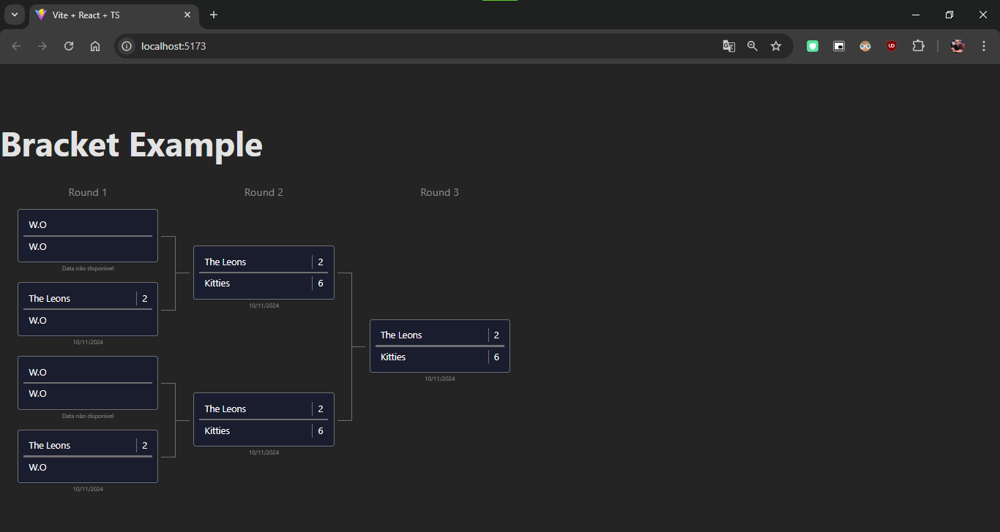

# Frameworks 2 Flix


O objetivo do projeto foi desenvolver um projeto para implementar a biblioteca @pawix135/react-brackets em um projeto com typescript.



## 🛠 Tecnologias

As seguintes ferramentas foram usadas na construção do projeto:
    "@pawix/react-brackets": "^0.4.7",
    "react": "^18.3.1",
    "react-dom": "^18.3.1"
    "@eslint/js": "^9.8.0",
    "@types/react": "^18.3.3",
    "@types/react-dom": "^18.3.0",
    "@vitejs/plugin-react": "^4.3.1",
    "eslint": "^9.8.0",
    "eslint-plugin-react-hooks": "^5.1.0-rc.0",
    "eslint-plugin-react-refresh": "^0.4.9",
    "globals": "^15.9.0",
    "typescript": "^5.5.3",
    "typescript-eslint": "^8.0.0",
    "vite": "^5.4.0"

## 🚀 Como executar o projeto

```bash

# Clone este repositório
$ git clone https://github.com/Gustavo-Cruz-Pinheiro/pawix-brackets-project.git

# Acesse a pasta do projeto no seu terminal/cmd
$ cd pawix-brackets-project

# Instale as dependências com
$ npm i

# Execute o comando para executar o projeto
$ npm run dev

# O seu projeto estará rodando no localhost:3000

```

## 👨🏽‍💻 Autor

Gustavo Cruz Pinheiro

### 🌐 Me siga nas redes sociais

<a href="https://github.com/Gustavo-Cruz-Pinheiro"></a>
<a href="https://www.instagram.com/gusttavo.cruz_"></a>
<a href="https://www.facebook.com/gustavocruzpinheiro"></a>
<a href="https://www.linkedin.com/in/gustavo-cruz-pinheiro-61b852217/"></a>
